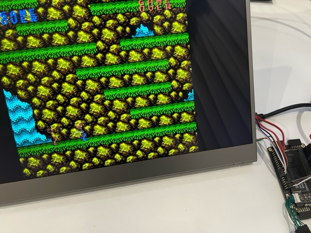

# NESTang

NESTang is a Nintendo Entertainment System emulator on the affordable [Sipeed Tang Primer 20K](https://wiki.sipeed.com/hardware/en/tang/tang-primer-20k/primer-20k.html) FPGA board. The core logic comes from [fpganes](https://github.com/strigeus/fpganes). I added SDRAM and HDMI interfaces and other things.

This is still a work in progress. Here's what works.

* Majority of games I tested work.
* 720p HDMI video and sound output.
* PC-side loader program for game loading and controller input.
* Cycle accurate emulation quality as we nearly recreated the NES circuits.
* Needs a MiSTer SDRAM module. Similar to [MiSTer](https://misterfpga.org/), SDRAM is needed for its low access latency required by emulation.

## Setup

Interested? Here's what you need:

* Sipeed Tang Primer 20K with Lite Carrier Board. About $30.
* Mister SDRAM module: [aliexpress](https://www.aliexpress.com/w/wholesale-mister-fpga-sdram.html) and [taobao](https://s.taobao.com/search?q=mister+sdram). I use a 128MB XSD v2.5. Others should also work as we only need 8MB of space.
* Muse-Lab HDMI PMod: [aliexpress](https://www.aliexpress.com/item/3256804122775243.html) and [taobao](https://item.taobao.com/item.htm?id=671021594308).
* Wires! These modules are not pin-to-pin matches for the board. So unfortunately we need wires to connect things up.

Now wire it up following [wiring instructions](doc/wiring.md).

Then it's time to play some NES games，
* Download a [NESTang release](https://github.com/nand2mario/nestang/releases/).
* Start **Gowin Programmer**, and program `nestang.fs` to the board. If you see a colorful NES palette, then your setup is working. 
* Connect your game controller/controllers to your PC. I use a pair of old Xbox 360 controllers.
* Run `loader.exe -c COM4 game.nes` (replace COM4 with your port number) to load the game `game.nes` and run it.

Hurrah! and enjoy.

## Next steps

Here are what I may work on when I get time. No promise though. Suggestions and pull requests are welcome!
* A way to work without a PC.
* Support more games.
* Easy hardware setup without wires etc, and an enclosure.
* Cheats support.
* Saves and loads.

## Special Thanks

* [fpganes](https://github.com/strigeus/fpganes) by Ludvig Strigeus.
* [hdl-util/hdmi](https://github.com/hdl-util/hdmi) by Sameer Puri.

nand2mario
2022.9