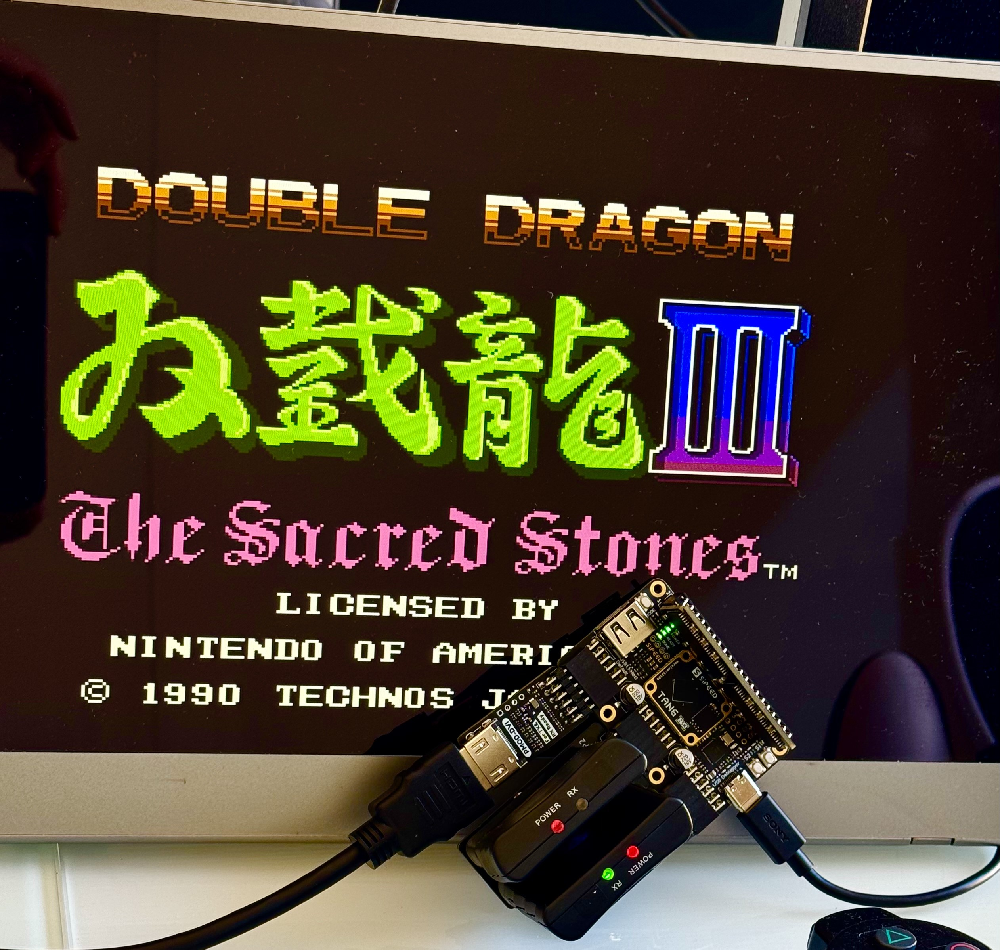
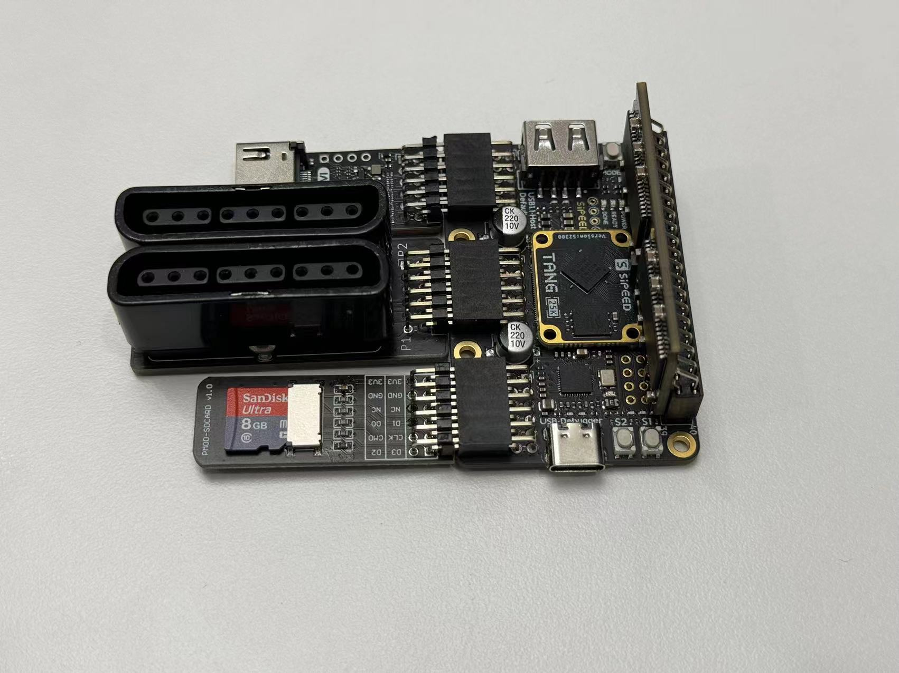

# NESTang - NES for Sipeed Tang FPGA Boards 

  

NESTang is an open source project to recreate the Nintendo Entertainment System (NES) with Sipeed Tang FPGA boards, including Sipeed [Tang Primer 25K](https://wiki.sipeed.com/hardware/en/tang/tang-primer-25k/primer-25k.html), [Tang Nano 20K](https://wiki.sipeed.com/hardware/en/tang/tang-nano-20k/nano-20k.html) and [Tang Primer 20K](https://wiki.sipeed.com/hardware/en/tang/tang-primer-20k/primer-20k.html).

Main features,

- 720p HDMI output with sound.
- Cycle accurate gameplay quality has been achieved since the NES circuits have been almost entirely replicated.
- Rom loading from MicroSD cards with easy-to-use menu system.
- Playstation 2 controllers support and experimental USB gamepads support.

## Setup for Tang Primer 25K

The Tang Primer 25K is the latest small-form-factor FPGA board from Sipeed. It features a modular design that is easily extensible with pmod and sdram modules. Here is what you need to run NESTang,

* The Tang Primer 25K with 4 modules: sdram, dvi, ds2 and sd, with the modules plugged in as follows (pmod positions are important as pins are fixed),  
* NESTang program [v0.8rc or later](https://github.com/nand2mario/nestang/releases), downloaded to the board with Gowin programmer.
* A MicroSD card to hold ROMS, formatted in FAT32. Then put the .nes roms in the root dir.
  * Windows does not allow FAT32 on cards >32GB, here's a [work-around](https://answers.microsoft.com/en-us/windows/forum/all/format-a-sandisk-extreme-64gb-micro-sd-card-to/ff51be64-75b9-435f-9d39-92299b9d006e). 
  * The roms may appear out of order. If you want them to show in alpabetical or other specific order, you can use [DriveSort](http://www.anerty.net/software/file/DriveSort/?lang=en).
* Connect one or two DualShock2 controllers to the DS2 pmod. Or you can connect one USB gamepad to use the [experimental USB gamepad support](doc/usb_gamepad.md). The board only has one USB port. So use DS2 if you want two players.
* Insert the MicroSD card, connect an HDMI monitor or TV, and enjoy your games.

## Setup for Tang Nano 20K

The Tang Nano 20K is a popular FPGA board for putting 20K LUTs and HDMI output into a tiny dongle. The board also features FPGA-gaming-friendly SDRAM memory. Here's what you need to run NESTang:

* The Tang Nano 20K board.
* Sipeed ps2 controller adapters connected to the board's pin 15-20 on both sides. Releases since 0.6 also support [USB gamepads](doc/usb_gamepad.md).
* Playstation or USB controllers connected to the adapters.
* HDMI cable to connect the board to a monitor.
* Latest NESTang program downloaded from [github](https://github.com/nand2mario/nestang/releases) and transferred to the board using either [openFPGALoader](https://github.com/trabucayre/openFPGALoader) or Gowin programmer.
* A MicroSD card to hold ROMS, formatted in FAT32. Then put the .nes roms in the root dir.
  * Windows does not allow FAT32 on cards >32GB, here's a [work-around](https://answers.microsoft.com/en-us/windows/forum/all/format-a-sandisk-extreme-64gb-micro-sd-card-to/ff51be64-75b9-435f-9d39-92299b9d006e). 
  * The roms may appear out of order. If you want them to show in alpabetical or other specific order, you can use [DriveSort](http://www.anerty.net/software/file/DriveSort/?lang=en).
* Insert the MicroSD card and power up the board to start playing your favorite games!

## Setup for Tang Primer 20K

See [setup instructions for tang primer 20k](doc/primer20k.md)

## Development

If you want to generate the bitstream from source, see [Build Instructions](https://nand2mario.github.io/nestang-doc/dev/build_bitstream/).

[Usb_hid_host](https://github.com/nand2mario/usb_hid_host) was development so NESTang could support USB gamepads. Follow the link if you want to use it for your FPGA projects. It supports keyboards and mice too.

## Next steps

See NESTang [changes.md](CHANGES.md).

Here are what I may work on when I get time. No promise though. Suggestions and pull requests are welcome!
* Cheats support.
* Saves and loads.

## Special Thanks

* [fpganes](https://github.com/strigeus/fpganes) by Ludvig Strigeus.
* [hdl-util/hdmi](https://github.com/hdl-util/hdmi) by Sameer Puri.
* [NES for Tang Nano 9K](https://github.com/hi631/tang-nano-9K) by hi631

nand2mario (`nand2mario at outlook.com`)

Since 2022.9
