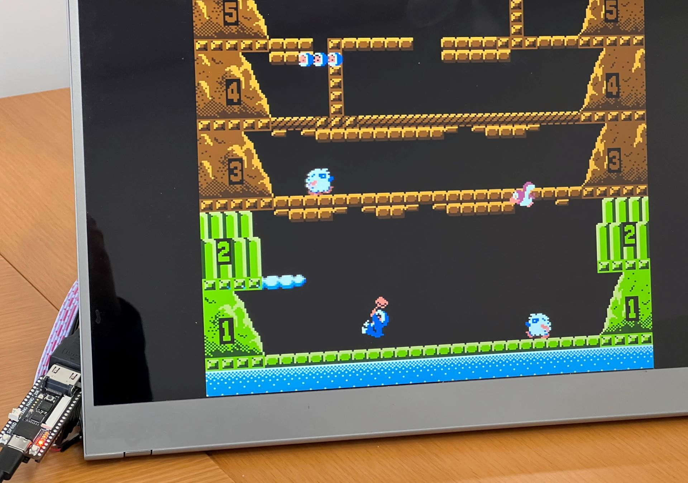

# NESTang - An NES Emulator for Sipeed Tang Nano 20K and Primer 20K FPGA Boards

  

NESTang is an emulator for the Nintendo Entertainment System (NES) designed to run on the affordable Sipeed [Tang Nano 20K](https://wiki.sipeed.com/hardware/en/tang/tang-nano-20k/) and [Primer 20K](https://wiki.sipeed.com/hardware/en/tang/tang-primer-20k/primer-20k.html) FPGA boards. The emulator's core logic comes from [fpganes](https://github.com/strigeus/fpganes), to which I have added SDRAM/DDR3 and HDMI interfaces, among other features.

It should be noted that this project is still a work in progress. The following aspects of the emulator currently work:

- The majority of games that have been tested function properly.
- HDMI output with a resolution of 720p and sound capabilities.
- Cycle accurate emulation quality has been achieved since the NES circuits have been almost entirely replicated.
- Game loading via MicroSD cards (for Tang Nano 20K only) or Windows/Linux loader program.
- Playstation 2 controller interface (for Tang Nano 20K only) or interfacing with controllers connected through a PC.

## Setup for Tang Nano 20K

Since the release of Tang Nano 20K in May 2023, running NESTang has become simpler and more stable. The board features SDRAM memory which is more FPGA-friendly than DDR memory. Here's what you need to run NESTang:

* The Tang Nano 20K board.
* Sipeed ps2 controller adapter connected to the board's pin 15-20.
* Playstation controller (wired or wireless) connected to the adapter.
* HDMI cable to connect the board to a monitor.
* NESTang 0.5 program downloaded from github.com/nand2mario/nestang/releases and transferred to the board using either [openFPGALoader](https://github.com/trabucayre/openFPGALoader) or Gowin programmer.
* A MicroSD card to hold ROMs. An 8GB cards should suffice. The `tools/nes2img.py` python program can be used to convert .nes ROM files to an .img file. Ensure that you have Python version 3.7 or higher, and then install the Pillow package using `pip3 install pillow`. You can then used an SD imaging tool such as [Balena Etcher](https://www.balena.io/etcher) to burn the newly created image onto the MicroSD card.
* Insert the MicroSD card and power up the board to start playing your favorite games!

## Setup for Tang Primer 20K

If you own a Tang Primer 20K board (which starts at $30), you will require a few additional components to run NESTang. However, if you don't own any board, it is recommended that you get the Tang Nano 20K instead.

To run NESTang on a Tang Primer 20K board, the following components are required:

* Sipeed Tang Primer 20K board
* Muse-Lab HDMI PMod if you got the "lite" version of Tang board. You can purchase it from [aliexpress](https://www.aliexpress.com/item/3256804122775243.html) or [taobao](https://item.taobao.com/item.htm?id=671021594308). The "dock" version of the board already has an HDMI port, so there is no need for this component. The wiring instructions for the "lite" version can be found in the [doc/wiring.md](doc/wiring.md) file.

Once you have all the necessary components, follow the instructions below:

* Download [NESTang 0.4](https://github.com/nand2mario/nestang/releases/tag/v0.4) since later versions only support Tang Nano 20K.
* Launch the **Gowin Programmer** application and program either the `nestang-lite.fs` or `nestang-dock.fs` file, depending on your specific board. If your setup is correctly configured, a colorful NES palette should be displayed. 
* Connect your game controller/controllers to your PC. I use a pair of old Xbox 360 controllers.
* Use the command `loader.exe -c COM4 games\rom.nes` (replace COM4 with your port number) to load the game `rom.nes`. If the game does not load, install [Microsoft Visual C++ Redistributable package](https://aka.ms/vs/17/release/vc_redist.x64.exe) to resolve any missing DLL errors.
* Press the left button (LB) to open the in-game OSD menu, from where you can load other games located in the `games` directory.
* If the game does not load, run `loader.exe -r game.nes` to generate error messages from the core.

Congratulations! Now you can enjoy all your favorite NES games. For version 0.4, a Linux loader program is also available. See [Linux loader](doc/linux.md) for details.

## Development

If you want to generate the bitstream from source, see [Build Instructions](doc/build.md).

Quite some time was spent on getting a low-latency (90ns) [DDR3 controller](https://github.com/nand2mario/ddr3-tang-primer-20k) to work for Tang Primer 20K. You may find that useful too.

## Next steps

See NESTang [changes.md](CHANGES.md).

Here are what I may work on when I get time. No promise though. Suggestions and pull requests are welcome!
* Support more games.
* An enclosure?
* Cheats support.
* Saves and loads.

## Special Thanks

* [fpganes](https://github.com/strigeus/fpganes) by Ludvig Strigeus.
* [hdl-util/hdmi](https://github.com/hdl-util/hdmi) by Sameer Puri.

nand2mario (`nand2mario at outlook.com`)

Since 2022.9
