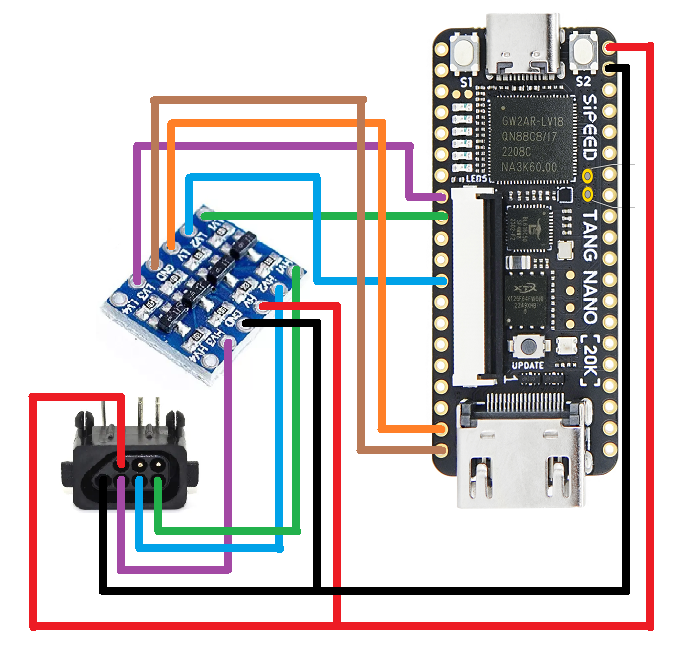
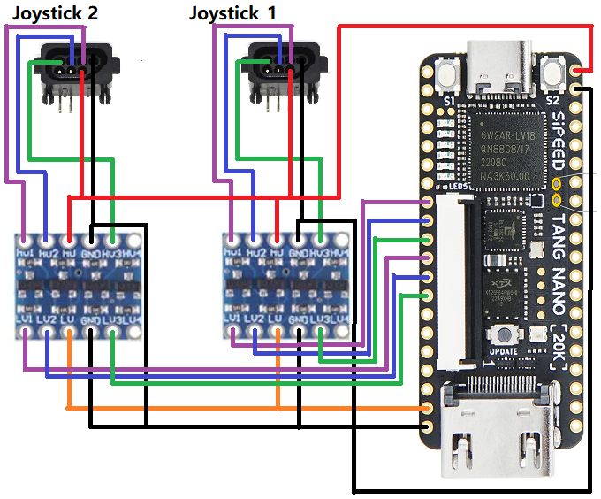
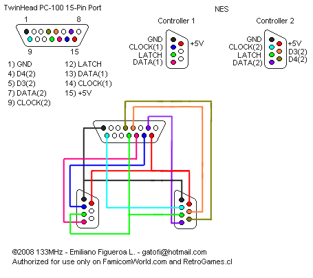

# Original NES Gamepad Setup

NESTang since 0.9(check with @nand2mario) supports Original NES Gamepads, also supporting 8BitDo gamepads.

## No Level-Shifter

This setup was tested using an [8BitDo N30 2.4g wireless gamepad for original NES](https://www.8bitdo.com/n30-wireless-for-original-nes/). After some testing, this controller setup does not require a 3V3<->5V level shifter and can be directly connected to the FPGA IOs.

### Requirements

- An original NES Gamepad
- Wires

### Wiring diagram

## Level-Shifter

In some cases, although not tested, probably cases such as original NES/Famicom controllers, TTL5V signals might be needed for correct functionality. In this case, a LVCMOS3V3<->TTL5V level shifter is needed.

### Requirements

- An original NES Gamepad
- Wires
- [4 Channels IIC I2C Logic Level Shifter Bi-Directional Module](https://www.aliexpress.com/item/1005004225321778.html?spm=a2g0o.order_list.order_list_main.27.22111802nFvcM9)
    - This is needed because NESTang has Low Voltage CMOS 3.3V signals and NES Gamepad uses 5V TTL logic.

### Wiring diagram

## NES to FamiCom

There's a way to convert 2 NES joysticks to FamiCom input connector:

