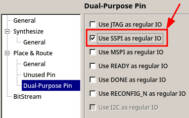

# Build Instructions

If you want to modify and/or build the project from source, you will need:

* GoWin IDE installed in your computer.
* This repository cloned.

## Build Steps

* Open the Project file `nes.gprj` in GoWin IDE.
* Go to `Project > Configuration` menu.
* In `Synthesize > General` tab, go to `Top Module/Entity` textbox and write `NES_Tang20k` (It is case sensitive, be careful!).
* In `Synthesize > General` tab, go to `Verilog Language` combobox and select `System Verilog 2017`.

* In `Place and Route > Dual Purpose Pins` tab, go to `SSPI as General Purpose IO` checkbox and mark it.

* Click `Apply` and then `OK` to exit the Project Configurations.
* The project is ready to be successfully Synthesized, Placed and Routed to a bitstream

Note: the master branch targets the Tang Primer 20K Lite board. Use the [dock branch](https://github.com/nand2mario/nestang/tree/dock) if you want to build for the Tang Primer 20K Dock.

Enjoy!!