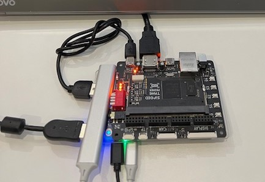
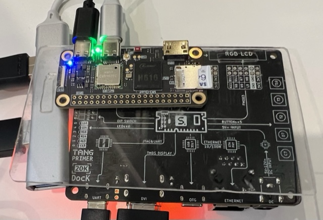

# NESTang Linux loader

Since 0.4, NESTang has added Linux loader program support. With a tiny and cheap Linux SBC, now you can enjoy fpga NES games on your living room TV much easier.

Here's the basic idea,

```
   +--------------------------+       +-----------------------------+
   |   Tang Primer 20K Dock   |       | Linux SBC (RPi, MangoPi etc)|-+
   |                          |       |                             | |  ROMs in MicroSD card 
   |       HDMI     USB-C     |       |  USB-A/OTG   USB-C/MicroUSB |-+
   +--------vvv------^^^------+       +------vvv-----------^^^------+
             |        '-------<-------.       |             '---------- USB power adapter
             |          UART o/ USB   |       |
   +---------v------------+       +---^-------v------+
   |     TV / Monitor     |       |      USB Hub     >----------------- USB gamepad
   +----------------------+       +------------------+
```

The loader binary is in the release zip archive (`loader_linux_aarch64`). If it doesn't work on your SBC, you can build your own by `make` in [loader/](../loader/).

My messy but working set up looks like this:

Top side:



Bottom side is the MangoPi:



Of course a 3d-printed box would be great. If you design one, please kindly contribute your design (email me).

