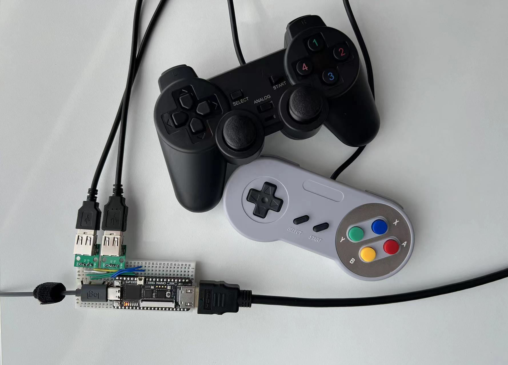
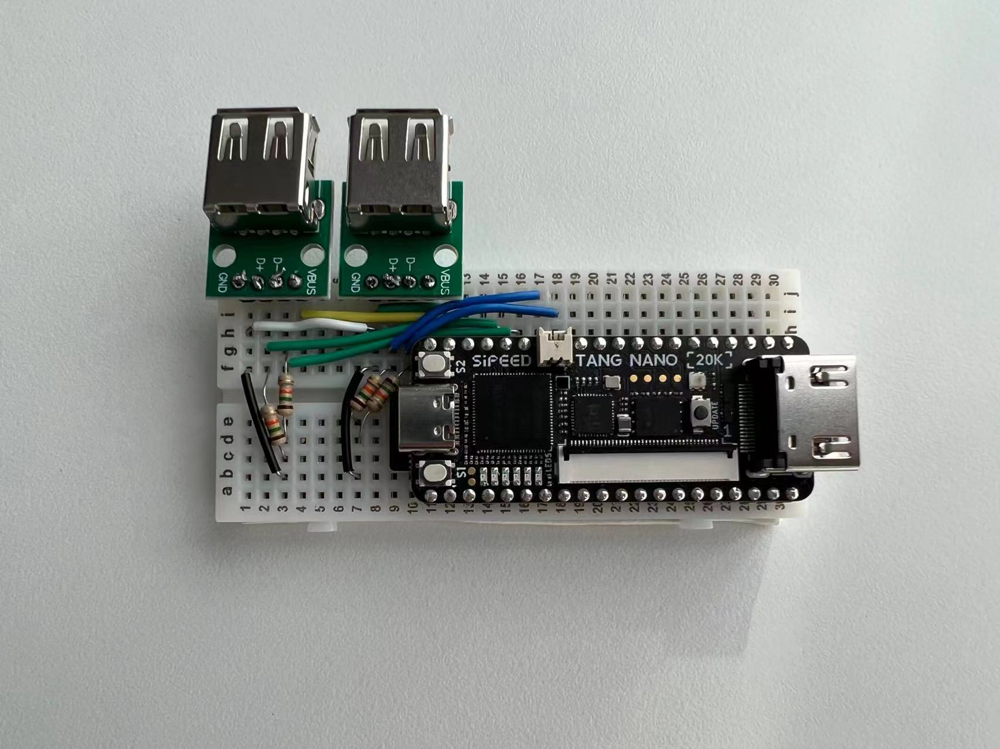

## Experimental USB Gamepad Setup

NESTang since 0.6 has experimental USB gamepad support, allowing you to use your existing controllers without the need to purchase new ones.

Limitations,

* Currently only USB low-speed gamepads are supported. So controllers like PS5 or Xbox 360 pads are not compatible. We do not have a compatible controller list yet. But here are two that I've tested,

* Tang Primer 25K only has one USB port. So you can only connect one gamepad. For Tang Nano 20K, you need to connect the circuitry yourself. 

## Wiring instructions for Tang Nano 20K

To try USB gamepads on Tang Nano 20K, you will need the following,
* Two USB-A Female to 2.54mm adapters, which can be found [here](https://www.aliexpress.us/item/2255800203914149.html?spm=a2g0o.productlist.main.17.6e617e229i3qAm&algo_pvid=89ee64ce-a2c8-41f6-9e3b-45e8396569fd&algo_exp_id=89ee64ce-a2c8-41f6-9e3b-45e8396569fd-8&pdp_npi=4%40dis%21USD%210.28%210.25%21%21%210.28%21%21%402132a25516924371147167093ec531%2110000001592482118%21sea%21US%214484896846%21A&curPageLogUid=dAeFgl6FWDAf).
* Four 15K ohm resistors as USB pulldown resistor.

Then wire things up correctly, refer to the image above and the [Tang Nano 20K pinout](https://wiki.sipeed.com/hardware/en/tang/tang-nano-20k/nano-20k.html)). Follow these steps,
* Connect USB VBUS to the 5V pin of Tang Nano 20K, and USB GND to the Tang GND.
* For controller 1, connect D+ to pin 42 and D- to pin 41.
* For controller 2, connect D+ to pin 56 and D- to pin 54.
* Connect four 15K ohm resistors from D-/D+ to GND.

Please note that using the resistors is necessary for stability.

That's all you need to do.

