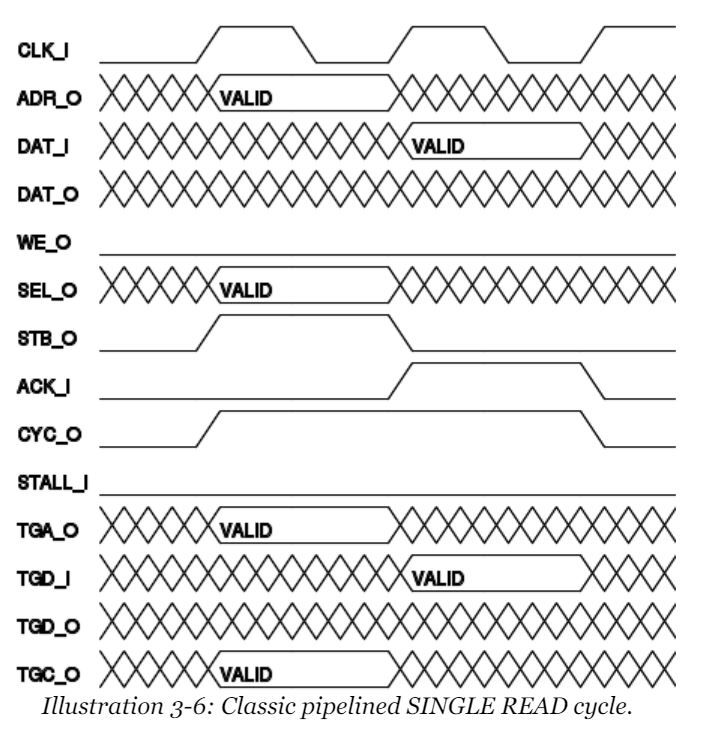
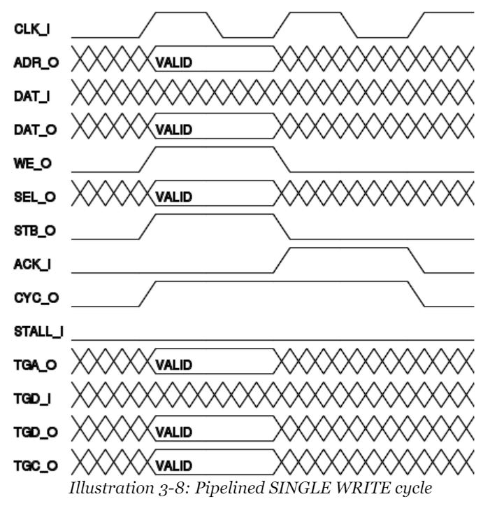

# Pipelined Wishbone B4 Bus

## About

- `iosys` is wishbone master
- No `FIFO` implemented
- No arbiter implemented
- 128bit wide bus for `cheat_wizard`

- Slaves
    - `wishbone_slaves.sh`

## Read

## Write

## References

- [Wishbone bus](https://en.wikipedia.org/wiki/Wishbone_(computer_bus))
- [Wishbone B4 Specifications](https://cdn.opencores.org/downloads/wbspec_b4.pdf)
- [zipcpu](https://zipcpu.com/)
- [Building a simple bus](https://zipcpu.com/zipcpu/2017/05/23/simplebus.html)
- [Building a Simple Wishbone Master](https://zipcpu.com/blog/2017/06/08/simple-wb-master.html)
- [Building a Simple Wishbone Slave](https://zipcpu.com/zipcpu/2017/05/29/simple-wishbone.html)
- [Building Formal Assumptions to Describe Wishbone Behaviour](https://zipcpu.com/zipcpu/2017/11/07/wb-formal.html)
- [Building a very simple wishbone interconnect](https://zipcpu.com/blog/2017/06/22/simple-wb-interconnect.html)